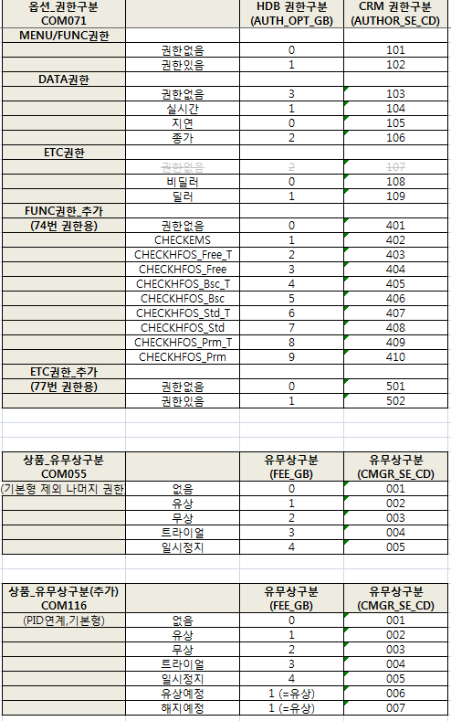

# [CRM] 나스닥 AUDIT 관련 권한 처리 V0.1

```
현재 CRM에서 조회되고 있는 PREBON 권한을 가지고 있는 대상이 신고내역과 달라 나스닥 감사단이 실제 방문하여 CRM 화면을 통해 조회할 때는 그 대상이 신고내역과 일치하게 하기위해 data 조작이 필요하다.   
```
### 메일내용


### 회의내용

1. 감사단 앞에서 PID 생성부터 `가짜PREBON` 권한여부에 대해 관련화면에 대해서 어떻게 동작하는지 시연한다. `가짜PREBON` 이지만 해당 PID는 권한여부에 따라 체크 단말 접속시 관련 화면에 대해서 `정상`동작을 해야한다.

2. 고객정보 - 고객정보관리 화면에서
  * `가짜PREBON` 권한부여 -> 관련 화면 보여짐
  * `가짜PREBON` 권한제거 -> 권한이 없다고 팝업이 떠야함. 

3. 감사날은 4/24(수) 평일 오전(장중)이라 체크를 이용하는 고객이 `가짜PREBON`의 조작으로 인해 영향을 받지 않아야 한다.

4. 체크단말 관련 화면
  - 금리스왑 : 3911, 3982, 3910, 3914
  - 해외채권 : 3924, 3926, 3930, 3931

5.  화면통계 - 화면별 조회고객 화면에서 
  - 총 건수가 조작한 인원수 보다 같거나 적은 숫자여야한다.
   
### 기타의견
1. `진짜운영DB`를 copy하여 `가짜운영DB`로 만들어 감사날만 쓸쑤 있도록 하자.
  -->`불가능`

2. `진짜PREBON`의 data가 들어있는 DB 테이블을 똑같이 만들어서  `가짜PREBON`의 값으로 대체하는것은 어떤지. 
  -->`복잡함`

3. CRM 고객정보에 대한 화면을 똑같이 복사하여 조작가능한 화면으로 만들고 (보여지는 data도 다 가짜), 실제 권한은 사무실에 있는 팀원이 몰래 권한을 준다. 
  -->`복잡함`


### 조작 과정

1. `가짜PREBON` 등록
  * 코드  : mysql의  TN_GOODS_OPTIONS , GOODS_OPTION_CD 구분값
  * 옵션2 : HDB의 CUST_OPTION_MAST , AUTH_NM 구분값
  * 옵션3 : HDB의 CUST_OPTION_MAST , OPT_NO  구분값


2. DB - 데이터 INSERT 처리

  * MYSQL,HDB INSERT / 관리자화면 옵션일괄변경 기능이용 -> 둘 중 택일.
  
  
  2-1. MYSQL , HDB  `가짜PREBON` 정보 INSERT

  

* 대상테이블  
  * MYSQL  : TN_GOODS_OPTIONS
    
  * HDB  : CUST_OPTION_MAST  ( 중요!! REG_DT =`'19700101'`, TRMN_DT=`'99991231'`)

  <p>
  <ul>
  <table class="table table-condensed table-sm small">
  <thead><tr><th>코드 구분</th><th>MYSQL</th><th>HDB</th></tr></thead>
  <tbody>
  <tr><td>실시간(무상)  </td><td>  104(003)  </td><td>  1(2)  </td>
  <tr><td>종가(무상)  </td><td>  106(003)  </td><td>  2(2)  </td>
  <tr><td>권한없음  </td><td>  103(000)  </td><td>  3(0)  </td>
  </tbody>
  </table>
  </ul>
  </p>

  


* MYSQL에서는 쉘로 작업하면 수월하다. HDB 상황실 또는 터미널에서 작업.

  


  2-2. CRM 관리자 화면 옵션일괄변경 기능 이용

  * 관리자페이지에서 "옵션 일괄변경" 메뉴 이용


3. `가짜PREBON` 정보를 `진짜PREBON`과 같게 설정

  * `가짜PREBON` (OPT_NO = '78') 을 등록하고, 전체 PID들에 대해 권한을 준 상태에서 `진짜PREBON` (OPT_NO = '47') 의  코드사용여부를 사용안함으로 변경 
  
  * `가짜PREBON` 옵션3을 `진짜PREBON` 옵션3과 같게 24로 변경 후 저장 
  -> 실제 HDB의 data로 권한유무가 주어지니, `진짜PREBON`의 값과 같게 맞춰준다.

  


4. 통계정보 > 화면통계 > 화면별 조회고객 

  * prebon과 관련된 8개의 화면에서 지정된 PID들만 조회되게 수정.
  StatsHdb_SQL_altibase.xml , HDB - PREBON_PID_LIST 참고

    


### 결론 
1,2,3 과정을 통해 `가짜PREBON`은 `진짜PREBON`의 data와 같게 되었고, `가짜PREBON`의 권한유무를 수정함으로써  `진짜PREBON`의 조작하는 효과를 보게 됨. `가짜PREBON` 의 조작으로 운영체크 단말에서 화면의 권한 유무를 바로 확인할수 있음.

* `진짜PREBON`을 바로 수정하지 않는 이유 : 
1. 감사를 위한 전체 PID의 `가짜PREBON` 실시간(무상),종가(무상), 권한없음 의 숫자가 실제 운영의 것과 다름 -> `가짜PREBON` 의 data로 감사기간 증명.
2. 평일 장시간에 이루어지는 감사 시간에 고객의 사용시간이 겹쳐 고객화면에 영향이 가면 안되기 때문이다.


