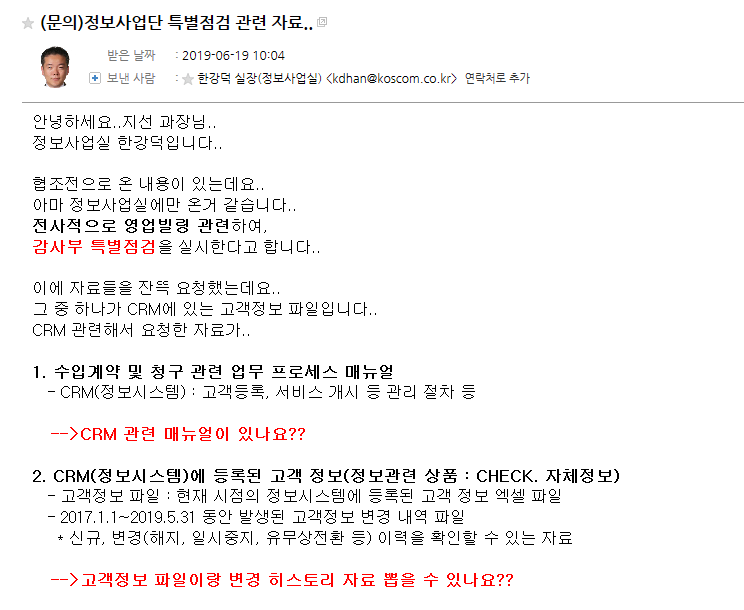

# [CRM] 나스닥 AUDIT 관련 권한 처리 V0.1

```
내부 특별감사 기간에 맞춰 CRM 이슈

```
### 메일내용




## 절차

1. CRM 사용자매뉴얼 정보 

    > https://crm.koscom.co.kr/bos/userManual/main.html

    1.1 PDF로 만들어서 전달하기

    * 해당 웹페이지에서 Cntrl + S, html 을 저장 (이미지가 들어가있는 상태로 저장됨) -> word로 html을 열어서 하이퍼링크 등 정리하고 다른이름으로 저장 -> PDF로 저장

[PDF 참고] (file/crm_userManual.pdf)

2. CRM 페이지 > 고객정보관리 

    2.1 현재시점의 고객정보 엑셀파일 다운로드 
    > 엑셀파일로 저장하기

    2.2 신규, 변경 이력을 확인할수 있는 자료 
    > 기산시작일 2017.01.01~ 2019.05.31 , 계약상태 정상,해지 둘다 체크하여 조회 -> 엑셀파일로 저장