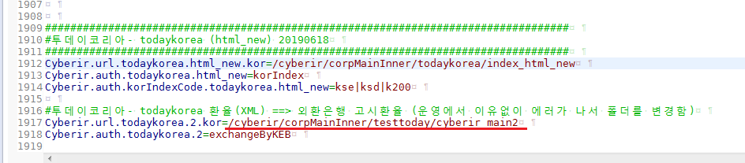

# 투데이코리아 고시환율 관련

```
cyberir.properties 에서 LS전선의 환율XML 정보와 같게 외환은행 고시환율로 같게 세팅을 완료 하였는데, 로컬(local)과 개발(dev)서버에서 잘 보여 이행하였더니 운영서버에서만 안보이는 현상 
```

 

> 시도

1. 구글링해보니 컴파일되지 않은 파일들의 에러 메시지.
 -> 로컬에서 컴파일 다시하여 운영으로 이동.  (X)

2. cyberir_main2.jsp  아예 jsp 파일을 못 찾아가는 것 같아서
cyberir_main8.jsp 바꿈 . (X)

3. 폴더를 살펴보니 todaykorea에 쓰기권한이 없음. (X)
  * chmod -R 775 todaykorea

4. cyberir.properties의 auth 정보와 url 정보는 그대로 두고 경로만 
testtoday로 폴더를 새로 생성하여 연결. `(해결)`

   


  ** 운영에는 클린의 기능이 없어서인지 한번 꼬이면 방법이 없다.....


