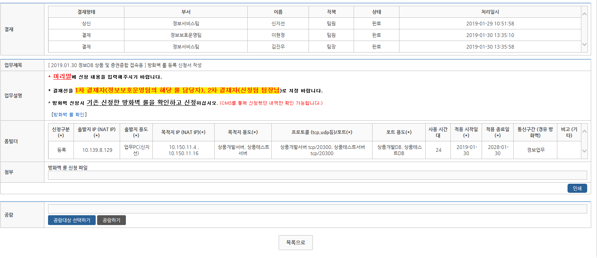
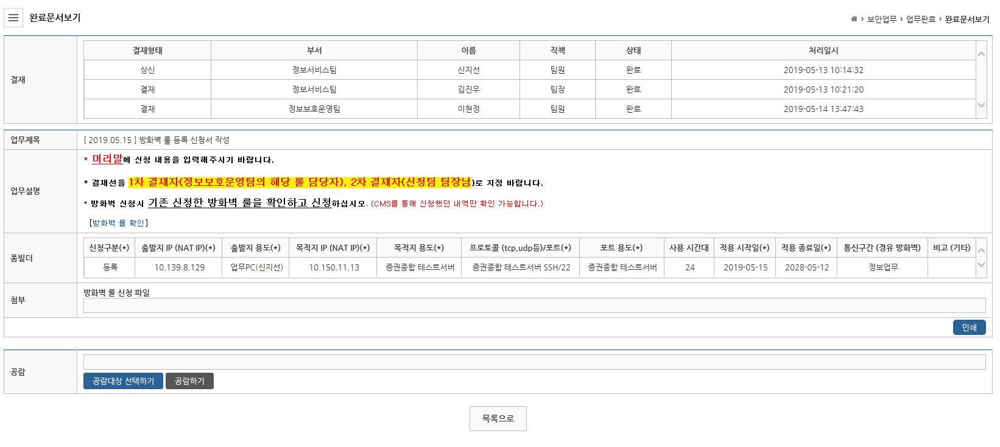

## CMS 신청 외

```
CRM, CYBERIR 에서 증권종합서버, 상품서버 
```

> XDB(Altibase상품, 상품개발서버/상품테스트서버) : 10.150.11.4 / 16 , 포트 : 20300
- dbsuper....

> HDB(Altibase상품, 증권종합서버) : 10.150.11.13
- AltiHDB : 포트 20300
    DCU, DCM....
- AltiInfo: 포트 20400
    dbsuper, dbwork...    



