# 경영공시 관련


### 1. 임원현황 및 조직도

```
발령이 난 이후에 경영지원부의 담당자가 관리자메뉴를 통해서 수정하기도 하지만, 대외협력부에서 모바일버전의 화면수정요청 이후 관리자페이지에서 모바일버전의 지원이 어려워짐. 직접 /mobile/cts/밑에 jsp 파일을 수정해야한다.
```
> 관리자페이지에서는 두 개의 메뉴로 존재, 경로는 하나의 jsp 파일을 바라보고있어, 한번의 수정으로 두 화면의 변경을 확인 할 수 있다.


1. 웹버전 : 조직도와 관련된 화면이 두 개의 메뉴로 존재함.

	* 코스콤소개 > 기업정보 > 회사조직 > 조직현황
	* 코스콤소개 > 경영공시 > 조직 및 인사 > 조직구성 > 조직현황

* [조직현황] 

<p>
<ul>
<table class="table table-condensed table-sm small">
<thead><tr><th>전체조직도</th><th> 설명 </th></tr></thead>
<tbody>
<tr><td>경로  </td><td>  /portal/images/intro/img_organ.gif</td>
</tbody>
</table>
</ul>
</p>


* [본부별조직도]
<p>
<ul>
<table class="table table-condensed table-sm small">
<thead><tr><th>구분</th><th> 설명 </th></tr></thead>
<tbody>
<tr><td>본부장 호칭  </td><td>  전무이사, 전무, 상무 까지만 호칭을 남긴다.</td>
<tr><td>임원사진  </td><td> 그룹웨어의 조직도에서 저장하여 사용한다. (/portal/images/intro/....jpg로 사용) </td>
<tr><td>전화번호 </td><td>  신승한차장, 허욱과장 담당 (혹은 대외협력부 이형진 과장)  </td>
<tr><td>주요약력</td><td> 신승한차장, 허욱과장 담당 (혹은 대외협력부 이형진 과장) </td>
</tbody>
</table>
</ul>
</p>

> /portal/css/contents.css  2개부터 8개의 부서까지 처리할 수 있고 기존 스타일을 참고한다.

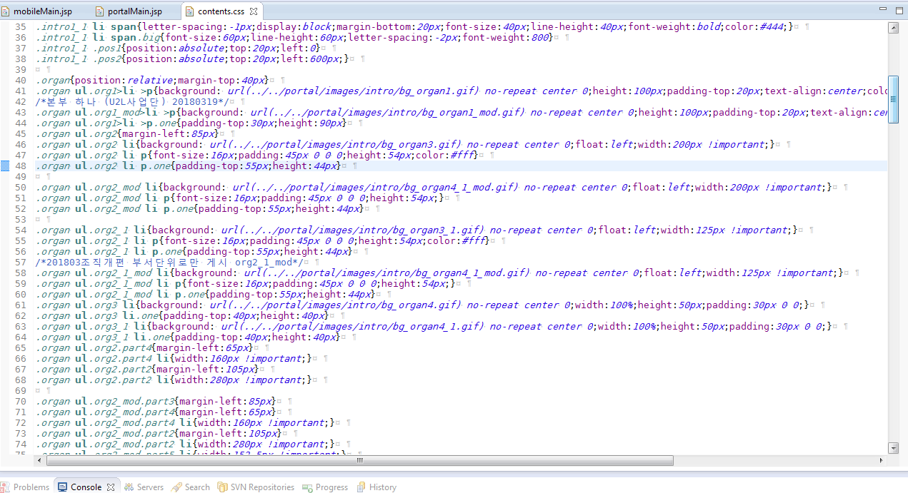 

* 새 본부의 갯수가 늘어나면서 본부별조직도 탭 밑의 나열의 폰트사이즈도 신경써야한다.
/portal/css/common.css 에서  .tabnavi5 ul>li>a {} 에서 padding 과 font-size를 조절한다.

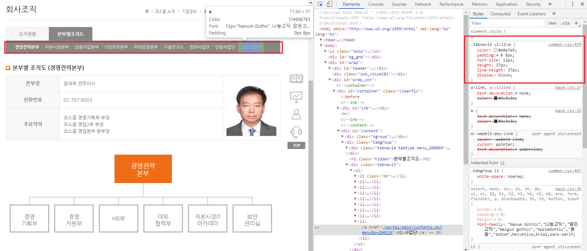 


2. 모바일버전

> 관리자페이지 > 사이트관리 > 메뉴관리 > 모바일국문메뉴관리에서 확인 - 소스의 직접수정이 필요.

*  /data/koscom/kc_portal/WEB-INF/jsp/mobile/cts/01/06/02/01
010602010101.jsp 안에 각 본부의 .jsp파일을 포함하고 있음.

<p>
<ul>
<table class="table table-condensed table-sm small">
<thead><tr><th>구분</th><th> 설명 </th></tr></thead>
<tbody>
<tr><td>임원사진  </td><td>  국문 웹버전과 공통 사용. (/portal/images/intro/.....)</td>
<tr><td>전화번호 </td><td> 웹버전과 동일 </td>
<tr><td>주요약력</td><td> 웹버전과 동일 </td>
</tbody>
</table>
</ul>
</p>


* 임원 설명 밑에 조직도는 웹버전의 조직도를 캡쳐하여 .png 로 저장  
(/mobile/images/contents/...)


### 2.  노동조합 가입정보 변경

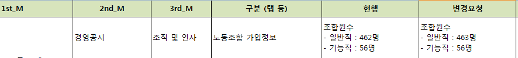 

> 콘텐츠 관리 > 국문콘텐츠관리 > 노동조합 가입정보

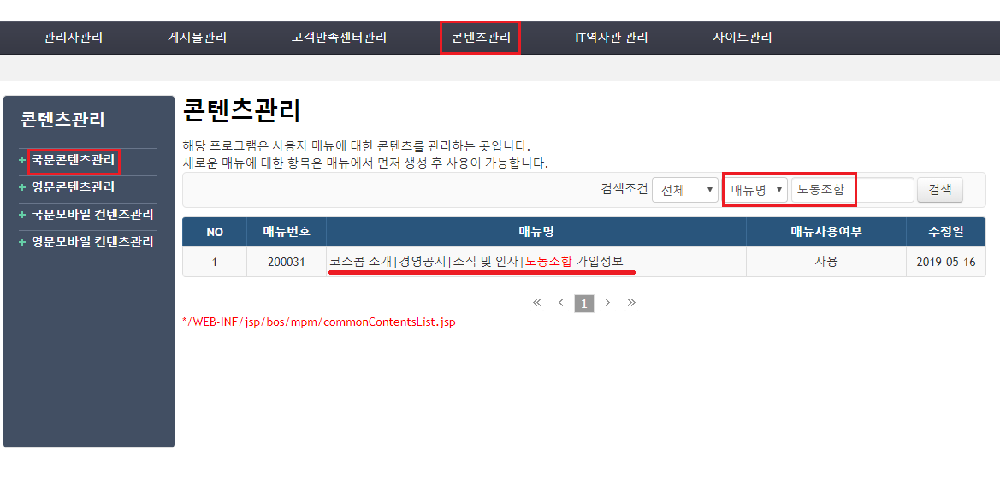 

> HTML 형식으로 보여지는 소스에서 반영 부분을 찾아 수정 후 저장 클릭

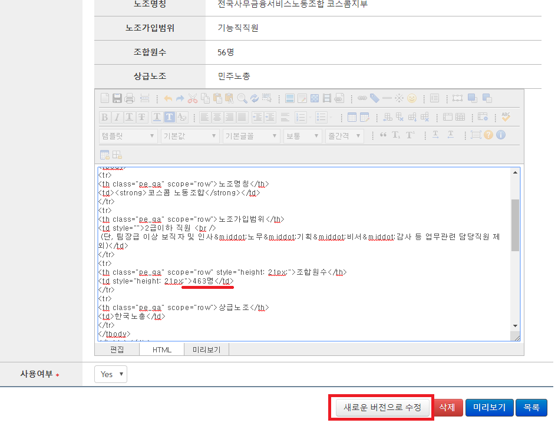 


### 3. 사이버홍보 상품 브로슈어 등록

>  위치 : 사이버홍보 > 홍보자료 > 상품 브로슈어

1. 개발서버에서 해당 화면으로 가면 아래에 소스위치를 참고.

	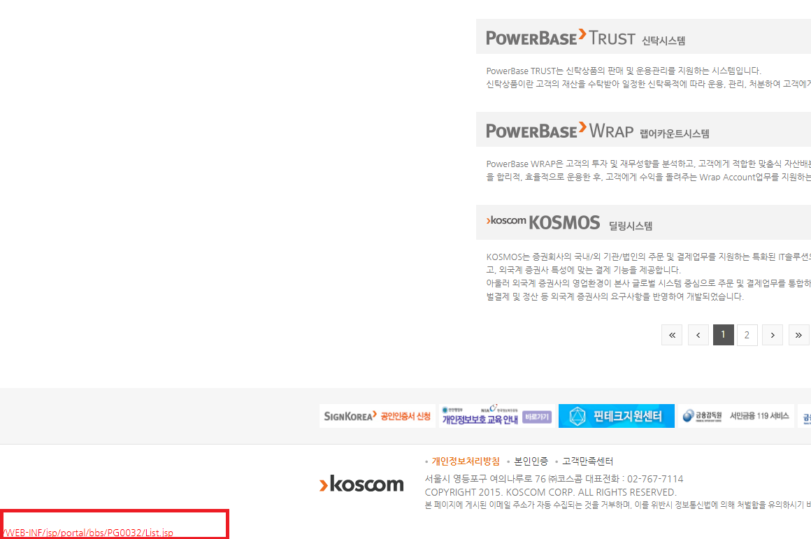 

2. 해당 위치의 소스를 보면 이미지와 PDF를 DB에서 가져온다.

	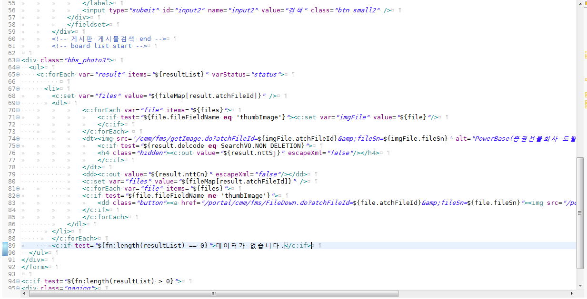 

3. 관리자페이지로 이동
	* 게시물관리 > 사이버홍보관 > 홍보자료 - 상품 > 글쓰기 클릭!

	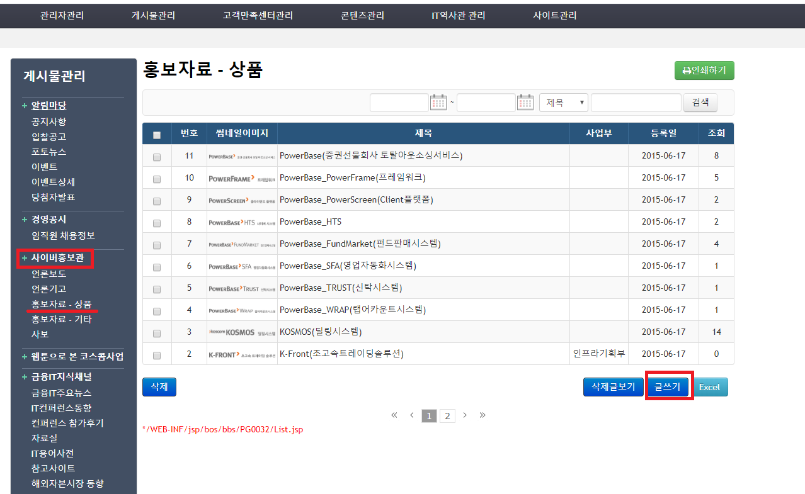 

4. 이미 등록된 상품에 대한 내용과 같이 새로운 상품 등록하면 된다. (상품 이미지파일, PDF파일 필요!)

	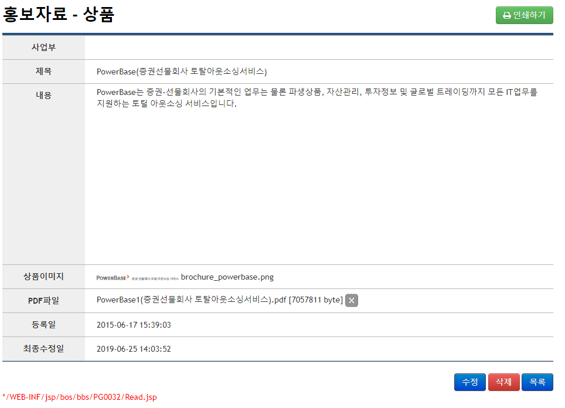 


# 사업분야 관련

### 1. 사업분야에 새로운 컨텐츠 만들기.
```
관리자메뉴관리, 대표국문메뉴관리, 대표영문메뉴관리, 모바일국문메뉴관리,모바일영문메뉴관리 에서 반영하고자 하는 메뉴를 선택함
```

> 관리자페이지 > 사이트관리 > 메뉴관리 클릭

1. 반영해야할 서비스영역에서 하위메뉴를 등록
2. 메뉴명 수정
3. 경로 지정
4. 개발/운영에 jsp 파일 반영

	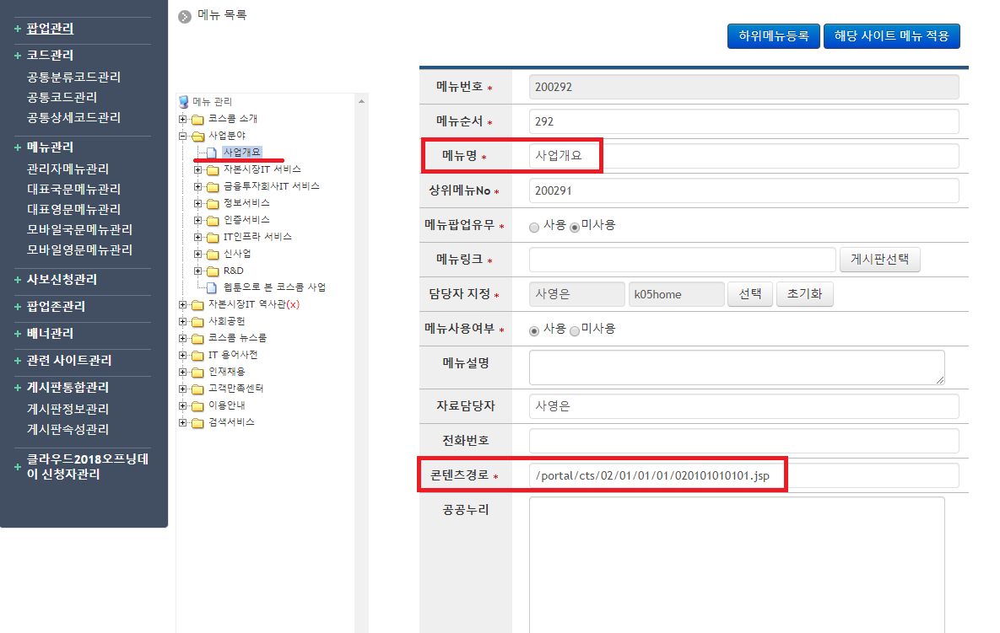 


### 2. 모바일버전 사업분야(탭을 포함한 화면) 새로 만들기

주로 사업분야에서 웹버전과 모바일버전이 컨텐츠를 공통으로 같은 경로를 바라본다.
하지만 웹버전 사업분야 에서 탭으로 구성되어 있는 컨텐츠는, 모바일버전의 화면을 새로 만들어 경로를 지정해준다.

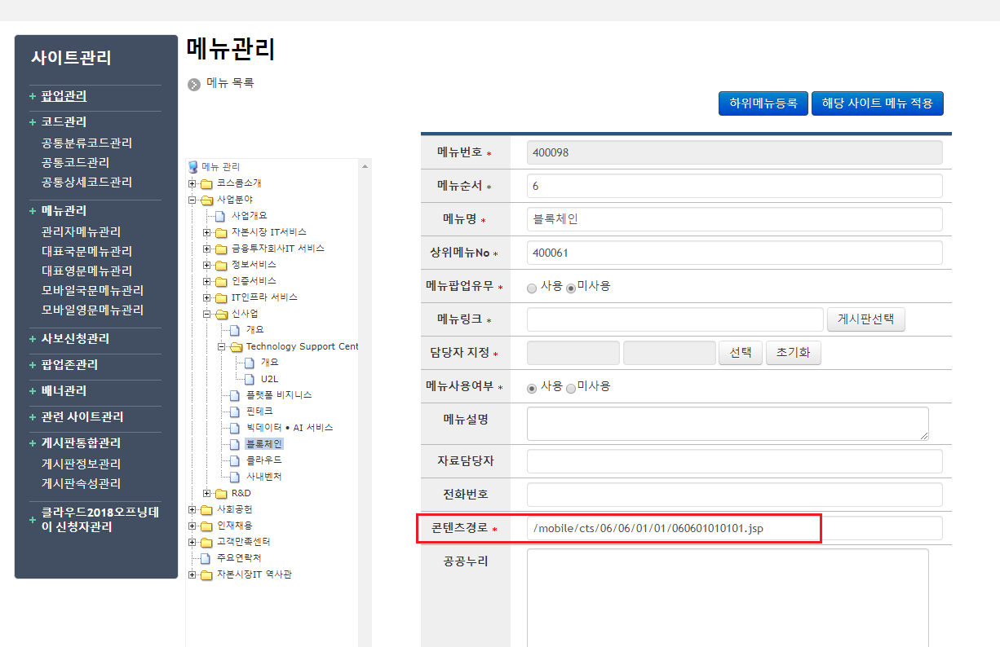

웹버전의 모든 탭 내용을 Ctrl + C -> 모바일버전의 하나의 jsp 생성 파일에 Ctrl + V 하여, 새로운 경로로 지정하여 저장하면 된다.


# 운영 관련


### 1. 소스 찾아가기

```
코스콤 홈페이지 소스 찾아가는것은 아래의 방법을 참고한다.
```

1. kctest.koscom.co.kr 에서 보면 화면아래의 경로

	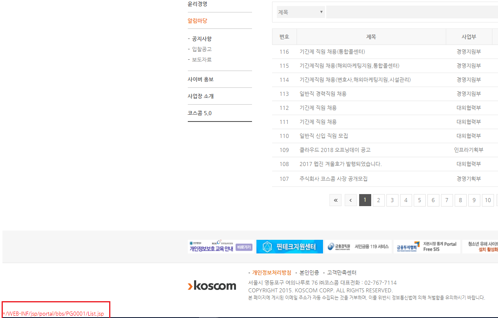

2. 관리자페이지 > 사이트관리 > 게시판통합관리 : 게시판URL , 테이블 참고 

	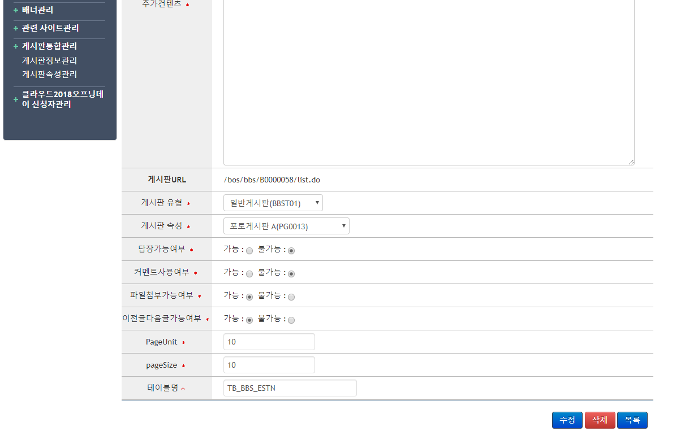

3. 이클립스 실행 console 창에서의 소스 참고  

	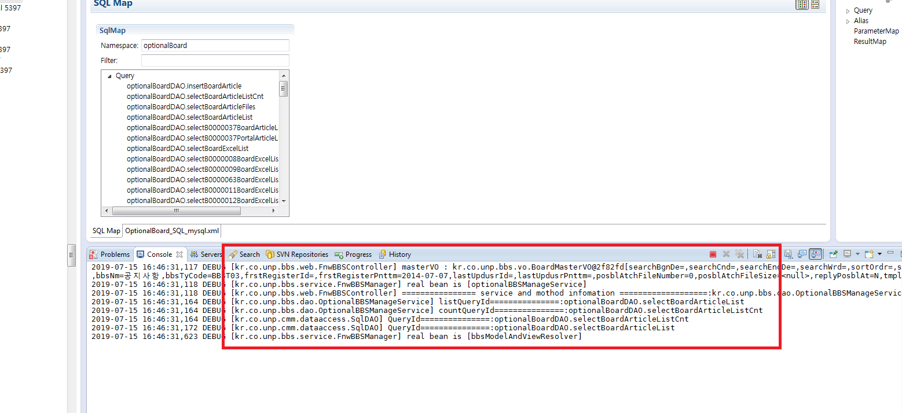


### 2. 메뉴삭제요청

관리자페이지 > 사이트관리 > 메뉴관리 > 해당 서비스 메뉴 클릭.
메뉴사용여부에서 미사용 으로 저장 -> 해당사이트메뉴 적용
(히스토리 보관을 위해 메뉴삭제보다는 사용여부에서 미사용을 권장함.)


### 3. 새로운 게시판 생성 및 메뉴 추가

금융IT지식채널에 해외자본시장 동향 게시글을 올릴 새로운 게시판을 생성해 달라는 요청사항이 옴.
* 현재 뉴스룸 메뉴의 자리가 금융IT지식채널의 자리임 (20190601에 개편된 홈페이지와 다른 구조지만, 새로운 게시판 생성시 참고)

관리자페이지 > 사이트관리 > 게시판통합관리 > 게시판속성관리
(PG0005 안에 B0000051 B0000052 등 BBS_ID는 여러개 있을수 있다.)

> [변경소스]
```
portal/common.css
PG0002/List.jsp
B0000063BBSManageService.java 신규생성
context-bbs.xml
OptionalBoard_SQL_mysql.xml
```

* 관리자메뉴에서 게시판 추가등록
해외자본시장 동향을 일반게시판B에 등록하니
자동으로 B0000063 이라고 생김 (/bos/bbs/B0000063/list.do)
메뉴관리에서 추가
메뉴순서를 바꿔줘야함. 메뉴팝업유무를 사용으로 하니 안나옴...미사용으로 맞추니 게시판이 보임. 문제는 submain 메뉴에서 해외자본시장 동향 글자가 안보인다 했더니
줄바꿈이 되어서 나와서 안보였던것.

> portal/common.css 추가
```
#header #gnb #gnb5>ul{width: 630px;}
```

> PG0002 > List.jsp 추가
```
<c:when test="${paramVO.menuNo == '200517'}">
	<p class="bu1">해외자본시장 동향의 자료를 공유합니다.</p>
</c:when>
```

* 컨텐츠 정보가 없어서 도대체 게시판을 어떻게 참고하나 했더니

관리자페이지 > 게시물관리 > 자료실 있음.
왜 해외자본시장 동향 게시판만 구분이 안찍힐까 

자료실(B0000009)과 같게 하였으니
B0000009BBSManageService.java 로 찾아봄.
CmmnCodeDetailDAO나오고
CmmnCodeDetailDAO.getDetailCodeList로 가져오는것을 발견

> context-bbs.xml , B0000063BBSManageService 추가

```
1)
<entry key="B0000063" value="B0000063BBSManageServiceDecorator" />

2)
<bean id="B0000063BBSManageService" class="kr.co.koscom.bbs.service.B0000063BBSManageService" parent="koscomCmmProgramService">
		<property name="excelQueryId" value="optionalBoardDAO.selectB0000063BoardExcelList" />
</bean>
	
3)	
<bean id="B0000063BBSManageServiceDecorator" class="kr.co.unp.bbs.service.CmmCodeBBSManageServiceDecorator">
		<property name="service">
			<ref bean="B0000063BBSManageService" />
		</property>
		<property name="codeIdData">
			<list>
				<value>COM058</value>
			</list>
		</property>
		<property name="propertyNames">
			<list>
				<value>option1</value>
			</list>
		</property>
		<property name="targetPropertyNames">
			<list>
				<value>option1Nm</value>
			</list>
		</property>
</bean>
```

> OptionalBoard_SQL_mysql.xml 
```
BBS_ID="B0000008"
BBS_ID="B0000009"
쿼리로 박혀있음.
optionalBoardDAO.selectB0000063BoardExcelList 추가
```


* 번외 : 담당자로 지정했는데도, 이형진과장 계정으로 해외자본시장동향 메뉴가 보이지 않음. 사이트관리 > 관리자메뉴 > 에서 백날 바꿔봤자 안됨

> 관리자관리> 권한관리 > 권한별 메뉴관리 에서 권한코드로 메뉴생성, 해외자본시장동향 체크 후 저장


### 4. 사이버홍보 관련

> 홈페에지 > 홍보자료 > 상품 브로슈어 탭

> 관리자페이지 > 게시물관리 > 사이버홍보관 > 홍보자료 - 상품

 

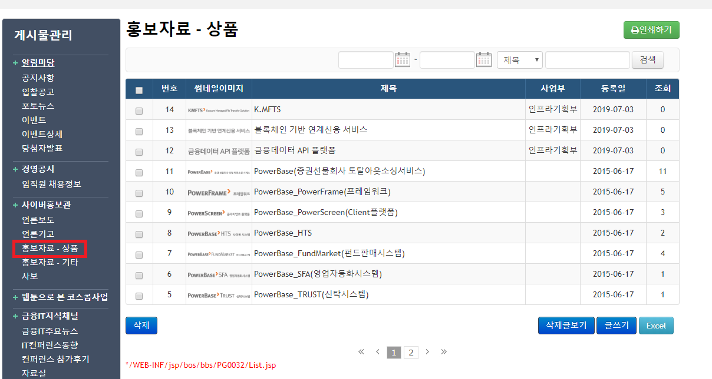

* 홈페이지에서 제목으로 검색할 수 있는 기능은 관리자페이지에서 새로운 상품으로 등록할때 입력하였던 제목으로 검색한다.


### 5. 회사 홈페이지 팝업

1. portalMain.jsp를 이용하여 팝업을 띄울 수 있다.
2. 관리자페이지에서 팝업 등록 가능하다.

> 관리자페이지 > 사이트관리 > 팝업관리 > 등록

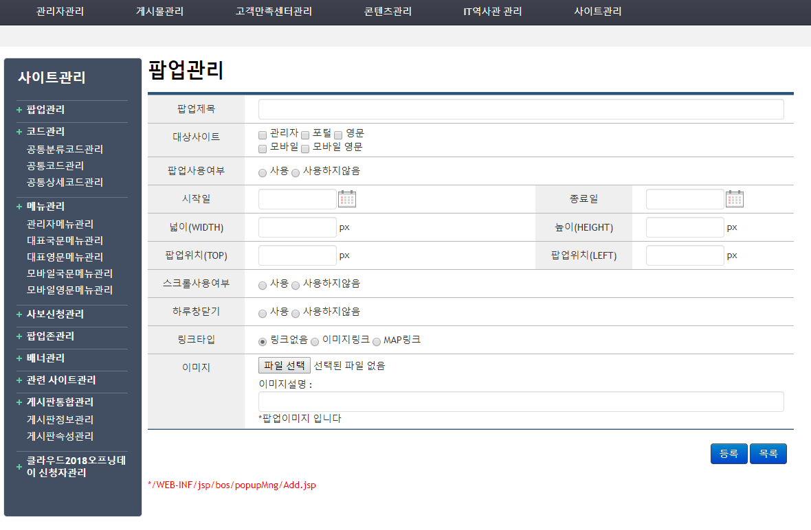

시작일과 종료일 지정.
대상사이트 : 포털 
넓이, 높이 : 대외협력부에서 주는 이미지의 사이즈.
팝업위치   : 대외협력부 요청사항대로 (대부분 메인이미지를 가리지않는 왼쪽과, 오른쪽으로 설정 - 그동안 등록되었던 팝업의 위치 참고.)


### 6. 배너 등록

> 관리자페이지 > 사이트관리 > 배너관리 > 등록

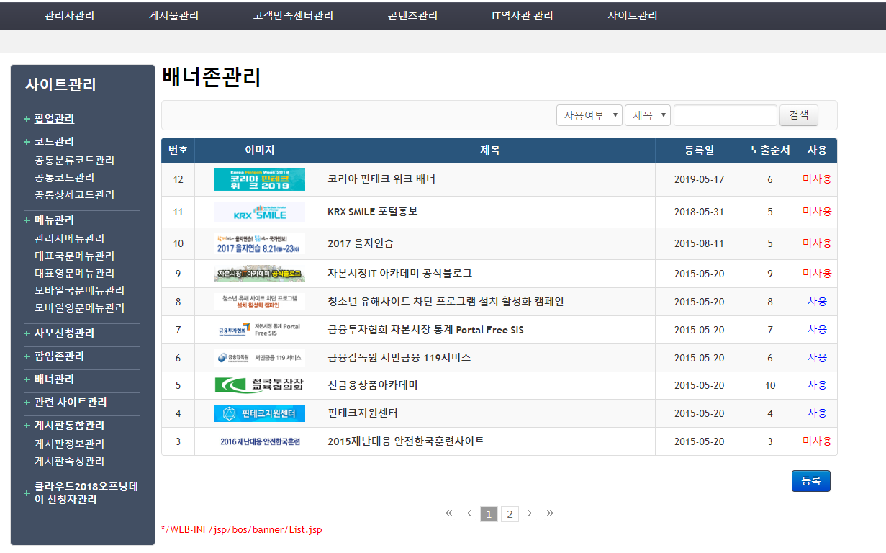

* 배너이미지 등록하여 첨부 후, 클릭하면 이동할 링크 URL 입력한다.
가끔 노출순서에 대해서 지정해주지만, 요청 없으면 순차적으로 나올 수 있도록 입력.


### 7. 관리자 추가 등록

> 관리자페이지 > 관리자관리 > 관리자정보 > 등록

* 아이디는 총관리자를 제외하고, k01home....k16home 의 형식으로 유지함.
비밀번호 5회 오류횟수 초과시 접속이 제한되므로 관리자페이지에서 해당ID의 비밀번호오류횟수 초기화버튼을 눌러준다.


### 8. 이사회의사록 등록

> 코스콤 홈페이지 > 코스콤 소개 > 경영공시 > 이사회 회의록

* 사내메일로 요청받은 이사회 회의록 첨부파일을 인터넷PC로 이동. 

> 관리자페이지 > 게시물관리 > 첨부파일 관리

1. 새로 글쓰기로 새로운 첨부파일을 등록할 수 있다.
 -> 새로운 파일넘버와 시퀀스넘버로 부여됨.
2. 등록된 게시글들 중 카테고리가 같은 글 클릭하여 첨부파일을 추가 등록한다.
 -> 파일넘버는 같고 시퀀스넘버로 추가한 파일갯수만큼 카운트되어 올라감.

	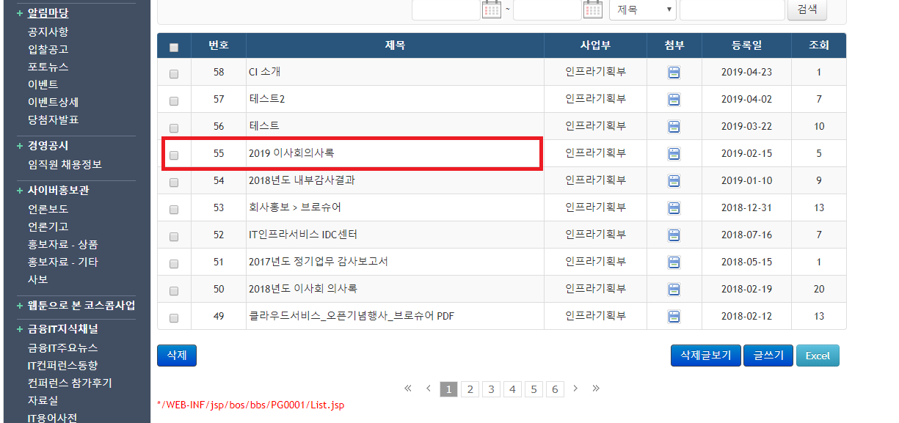

	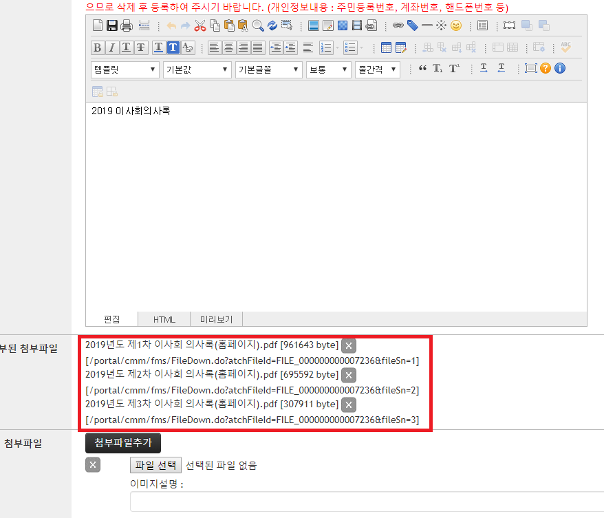


저 경로를 복사하여,

콘텐츠관리 > 국문콘텐츠 관리 에서 메뉴명 : 이사회 회의록 으로 검색.
HTML 테이블 코드 참고하여, 새로운 게시글 등록. 아까 복사하였던 첨부파일경로를 붙여넣는다.
(생성일자 : 주로 법무팀에서 메일로 함께 요청.)

새로운버전으로 수정 버튼 클릭.


### 9. 회사 홈페이지 코스콤 뉴스룸 화면 기사 게시 요청 

```
주로 2-3주 한번씩 뉴스룸 기사 업데이트 요청이 온다.
```

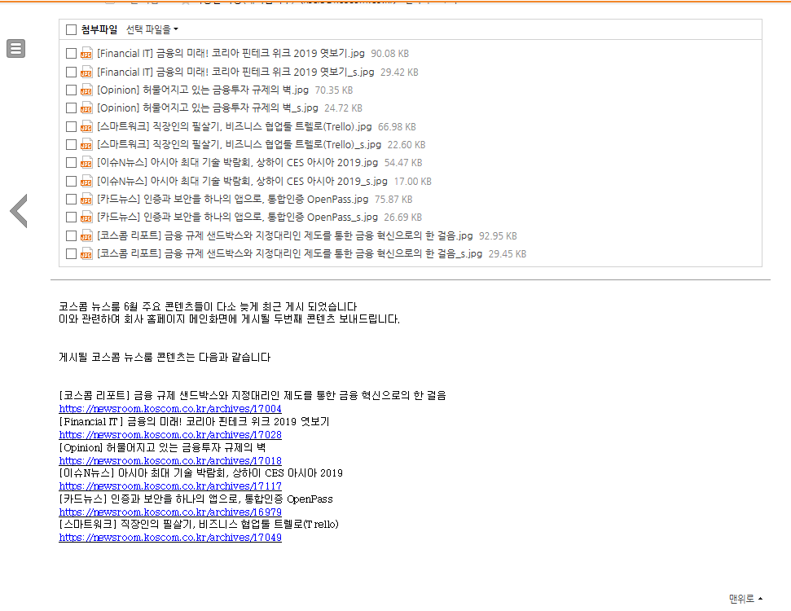

* 뉴스룸은 국문 웹버전과 모바일버전에만 해당한다.

> portalMain.jsp 에 뉴스룸 게시와 관련된 소스 참고한다.

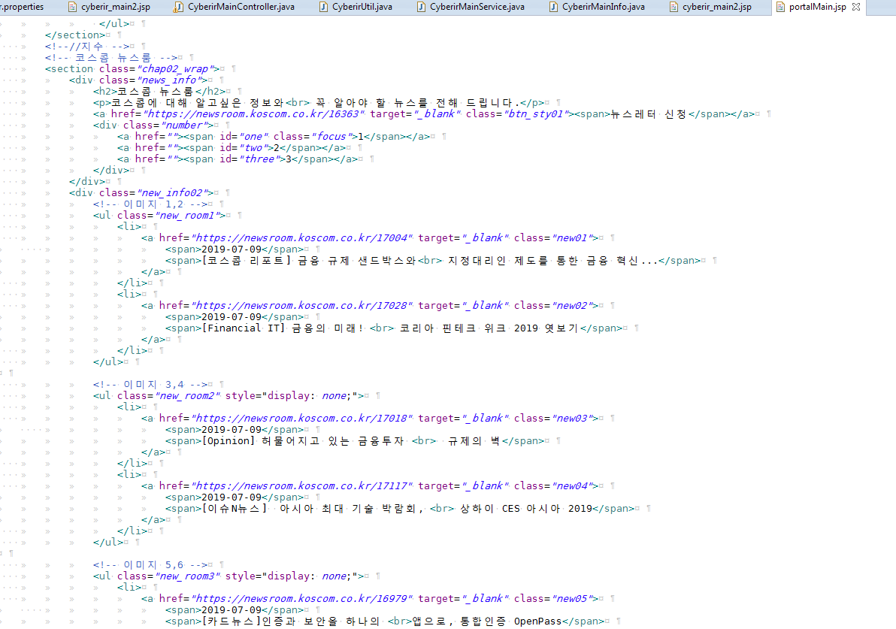


화면에서 게시되는 뉴스의 제목 글자 길이를 이전버전과 비교하여 업데이트.
첨부된 이미지는 웹버전 이미지경로와 모바일버전 이미지경로로 넣어주고, 
기사 링크 수정 후, 개발서버에서 확인을 받는다. 

모바일버전에 대해서는 개발서버에서 최대한 비슷하게 확인하는 방법은 아래와 같이 크롬에서 F12 개발자버전 모드로 모바일버전으로 확인하는것.
(주로 iphoneX, Galaxy S5으로 선택하여 확인하면 왠만하면 다 커버하는듯 하다.)

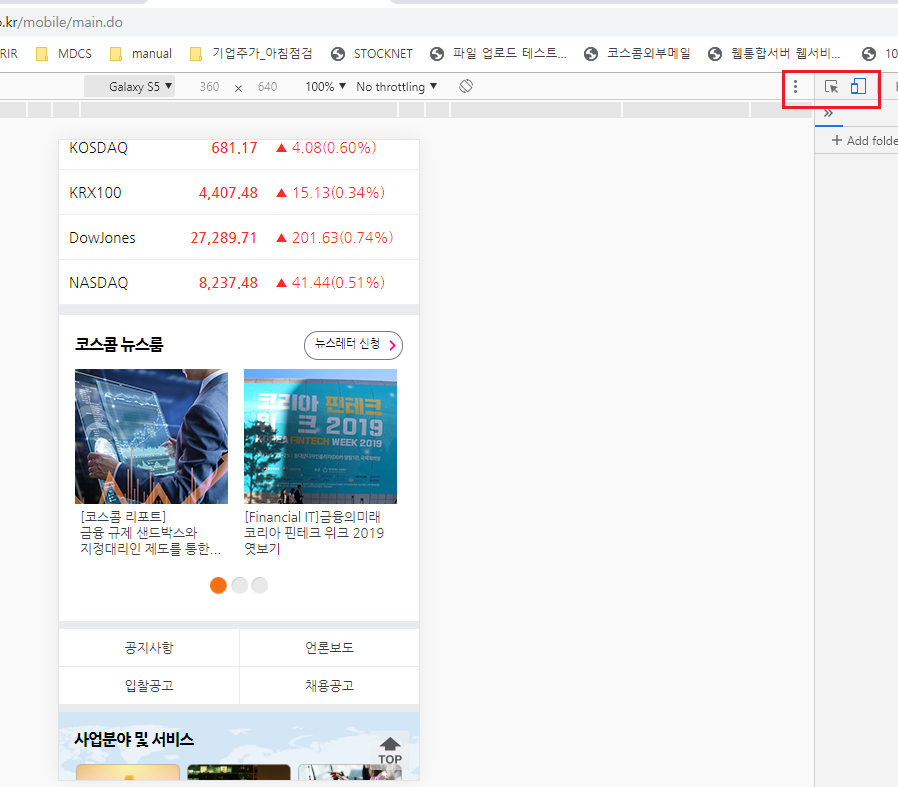

개발서버 확인 후 운영으로 이관.


### 10. 관리자페이지에서 채용게시판 글 게시 -> 알림마당 공지사항 게시판과 동일등록

```
채용공고에 새로운 글을 게시하면, 알림마당 공지사항 게시판에도 동일 등록이 될 수 있도록 선택할 수 있는 기능을 만들어달라는 요청이 왔다.
```

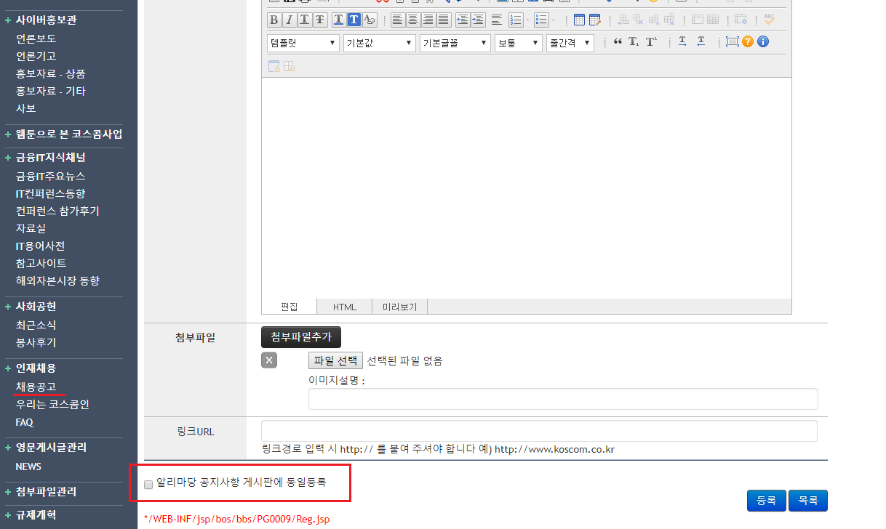

* 채용공고에 새로운 게시글을 등록했을 시, 체크박스 선택 -> 알림마당 공지사항에도 동일 게시가 되도록 하면 된다.

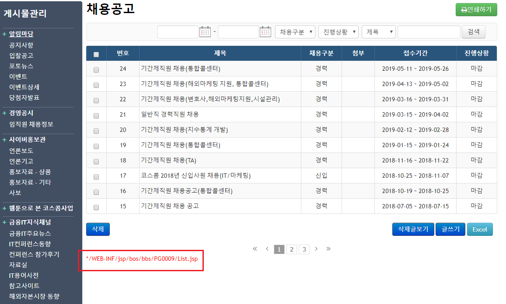

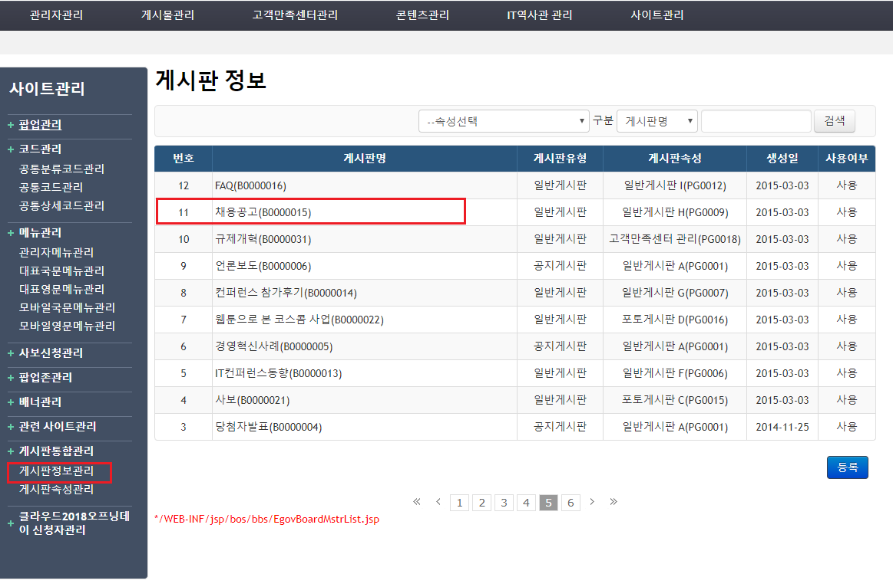

> 관리자페이지 > 사이트관리 > 게시판정보관리 에서 해당 게시판명과 연결되는 코드 확인 -> 게시판코드명의 자바소스가 없을시 새로 생성하여야 함.
B0000015 채용공고
B0000001 공지사항
(B0000015BBSManageService.java)

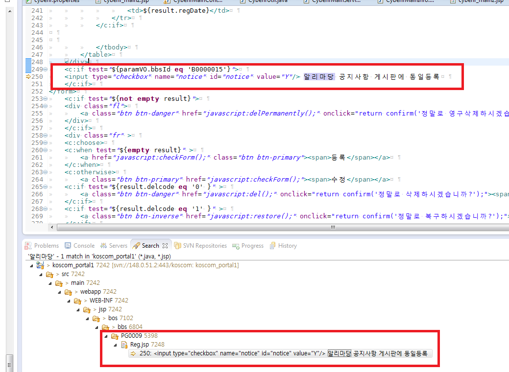

* 새로운 등록과, 수정에 대한  INSERT, UPDATE  fucntin 추가.

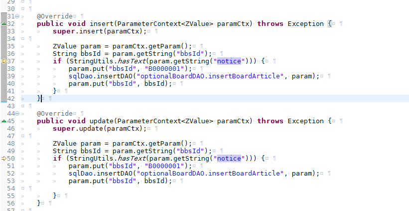

* 해당 쿼리 : 
> /koscom_portal1/src/main/resources/egovframework/sqlmap/kr/co/unp/mysql/OptionalBoard_SQL_mysql.xml
id : optionalBoardDAO.insertBoardArticle 


# 조치내용

### 1. 코스콤 홈페이지 첨부파일 문제시 수동 업로드 방법
```
INSERT 와 UPDATE 의 방법이 있다.
```
> 해당 테이블 :
TC_COMMNFILE , TC_COMMNFILE_DETAIL

 * 첨부파일의 경로: /data/koscom/kc_portal/upload/bbs/B0000051
해당위치의 달별로 폴더가 존재, 첨부파일을 넣어준다.

** 참고) TC_COMMNFILE에서의 
2019-04-02 15:16:17 의 날짜순서대로
TC_COMMNFILE_DETAIL의
FILE_201904021516177270.pdf 
파일명을 바꿔주는것이 포인트

```
INSERT INTO TC_COMMNFILE 
( ATCH_FILE_ID
, FRST_REGIST_PNTTM
, USE_AT)
values
( 'FILE_000000000007201'
, '2019-04-02 15:16:17' 
, 'Y' );

SELECT * FROM TC_COMMNFILE order by FRST_REGIST_PNTTM desc limit 5;
  
INSERT INTO TC_COMMNFILE_DETAIL 
( ATCH_FILE_ID
, FILE_SN
, FILE_STRE_COURS
, STRE_FILE_NM   
, ORIGNL_FILE_NM 
, FILE_EXTSN      
, FILE_MG         
, FILE_CN         
, FILE_FIELD_NM  
, CUSTOMSATIS_YN)
values(
'FILE_000000000007201'
, 1
, '/data/koscom/kc_portal/upload/bbs/B0000051/201904'
, 'FILE_201904021516177270.pdf'
, '[코스콤] 정관(20190328).pdf'
, 'pdf'
, '8875844'
, ' '
, 'file_1'
, 'N'
);

SELECT * FROM TC_COMMNFILE_DETAIL order by ATCH_FILE_ID desc limit 5;
```

* UPDATE의 위의 방법과 같다. 


### 2. 관리자 권한 DB에서 UPDATE

```
관리자페이지 에서 관리자권한 테스트하다가 koscomadmin 총관리자 권한을 바꾸니 메뉴가 안보임
```

> 해당 테이블 : TM_ADMIN
```
UPDATE TM_ADMIN SET AUTHOR_CODE="ROLE_SUPER" WHERE USER_ID = "koscomadmin"
```


