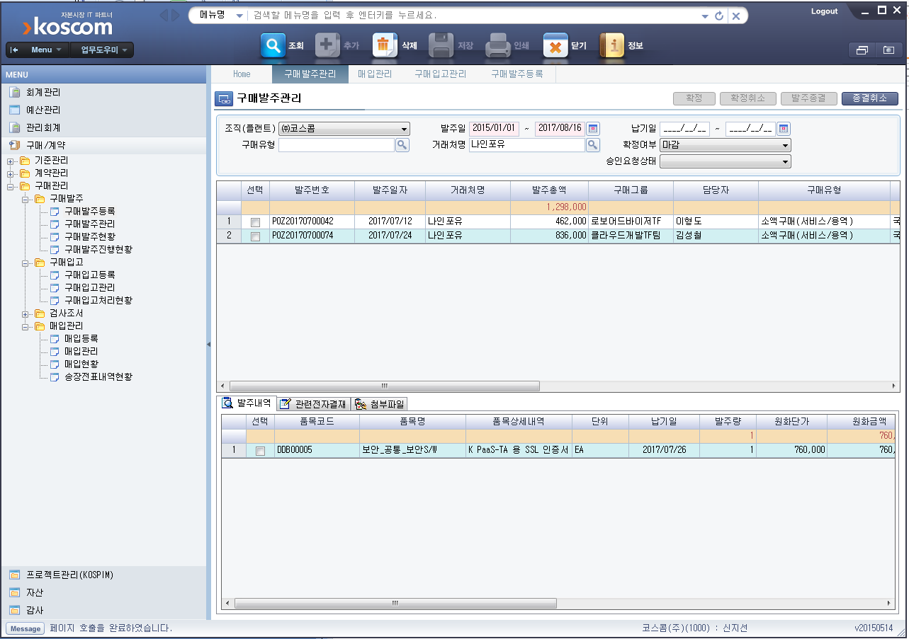

# 웹접근성 신청절차 (갱신)

코스콤 사업자 등록증 번호 : 116-81-02-919

![PDF 참고] (./../file/2019/코스콤_사업자등록증_2018.pdf)

> 회사 웹메일 

* [WA품질인증] 신청/ 코스콤 홈페이지 제목의 메일에서 심사신청하기 버튼을 눌러, 신청.xls를 다운받아 작성하여 제출하기.

* 견적서를 메일로 주면 유선이나 메일로 진행 결정 -> 세금 계산서를 발행해주면 그걸로 회사 부서 ESS 에서 진행한다.

> 웹와치로부터 받은 서류

1. 웹와치_주식회사_사업자등록증 
2. 웹와치_주식회사_통장사본
3. 세금계산서 
4. 자가진단보고서(국문/영문)

> ESS 진행절차 캡쳐

 

> 구매발주 등록 -> 구매발주관리 후 승인상태를 기다림. (체크박스 클릭 후, 확정을 누르면 소액결제지정에서 본인 승인으로 뜬다.)

 

> 구매발주승인 후-> 검사조서작성, 입고불러오기로 시작 (검사일자는 세금계산서 발행 날짜로 지정.)
> 검사종료일자가 세금계산서 발행날짜를 넘어서면 안됨. 꼭 종료일을 세금계산서 발행날짜로 지정!!!!
> 6344 허재선님께(ERP담당) 문의
> 검사조서를 삭제하였을때는 검사조서회수 버튼을 먼저 누르고, 삭제를 하여야한다.
> 매입등록까지 진행이 되어있었던 터라 매입등록건도 삭제함.
> 등록순차적으로 역순삭제 

 

 

 

> 김상용차장님 확인, 본인(신지선) 확인 후 진행

 

> 아래의 이미지는 SSL 관련 

 
 
 
 

 
 

